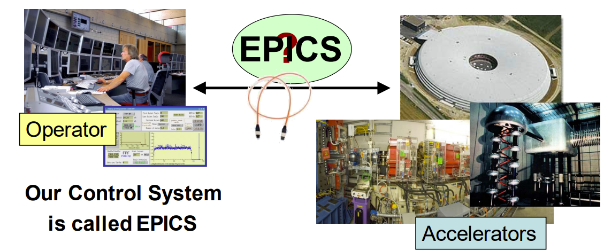
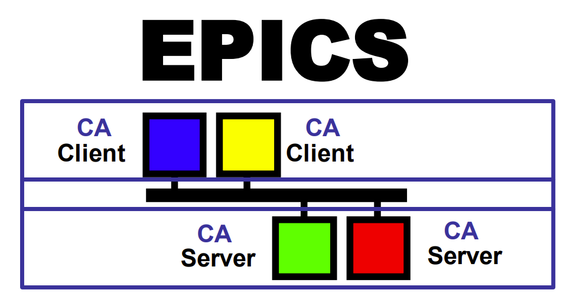
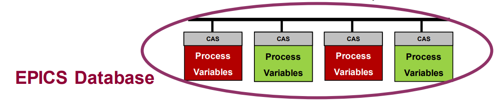
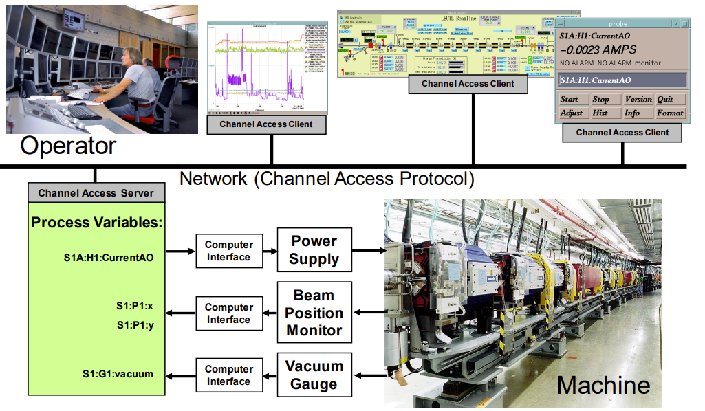
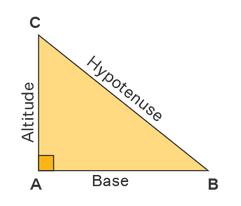

Control Engineering
===================

Control Systems and Introduction to the EPICS Toolkit
-----------------------------------------------------
**Accelerator Control System:** connects the Operator in the control room with the accelerator hardware. The control room might not be near the accelerator.

*For example:* SESAME has N Computers, N magnets, N vacuum pumps, 5 beamlines, a cooling system, RF system, power supply system, ... etc. which all need to be closely and heavily controlled.

**Experimental Physics and Industrial Control System (EPICS)**: is a collaboration software tool kit, that provides a control system architecture suitable for research and industrial facilities such as accelerators. EPICS uses a Client/Server and Publish/Subscribe methods and a Channel Access network protocol (3-tier architecture or 3 layer model). 

EPICS is an *open-sourced* project assembeled by multiple collaborators in the accelerator industry, 12+ accelerators around the world have provided assistance in its development and still use it to this day. 

**Channel Access:** A protocol to transfer data over network, a single data unit is called a **Process Variable**. The entire set of Process Variables establish a Distributed Real-time Database of machine statis, information and control parameters.

**Channel Access Network Flow:**

1) Query: broadcast and connection request.
2) Answer: direct connection
3) All further queries and answers work directly (Point-To-Point)

.. image:: images/EPICS_slide12.png

**Main Access Commands in EPICS:**

- ``caget``: returns the value of the PV or any sub-fields in the PV. 
- ``caput``: sets a value of a PV or a sub-field in a PV to a desired value and displays the old and newly assigned values.
- ``camonitor``: sets up a monitor and continuously prints incoming changing values for PVs.
- ``cainfo``: Prints all available channel status and information for a PV.

Packages that required for EPICS installation 
.............................................

- **gcc**: GCC stands for GNU Compiler Collection. It is a collection of programming language compilers and tools, primarily used for compiling and linking C, C++, and Fortran programs. GCC supports multiple platforms and is widely used in the development of software applications.

- **gcc-C++**:This package is an extension of GCC and specifically includes the C++ compiler. It is required if you want to compile and build C++ programs using GCC. The package provides the necessary libraries and headers for C++ development.

.. code-block:: bash

        # To install the GCC compiler, run the following commands:
        sudo dnf clean all
        sudo dnf update
        sudo dnf group list
        sudo dnf group install "Development Tools"

- **make** : Make is a utility used for building and managing software projects. It is used to automate the process of building executable programs and libraries from source code. The "make" utility uses a "Makefile" to define the build process. It is a text file that contains instructions for the "make" utility to execute. The "make" utility is often used in conjunction with the GCC compiler to build software projects. The "make" utility is included in the "Development Tools" package group. If you have already installed the "Development Tools" package group, you do not need to install the "make" utility separately.

.. code-block:: bash

        # To install the make the following command:
        sudo yum install make

- **gcc-toolset-9-make**: This package is a part of the GCC Toolset, which is a collection of development tools and libraries. It includes the "make" utility, which is used to manage and build software projects. The version number "9" in the package name refers to the specific version of the GCC Toolset. It is likely that this package includes GCC version 9 and the associated "make" utility.

.. code-block:: bash

        # To install the gcc-toolset-9-make from source the following command: 
        wget https://dl.rockylinux.org/pub/rocky/8/Devel/x86_64/os/Packages/g/gcc-toolset-9-make-devel-4.2.1-2.el8.x86_64.rpm

        # To install the gcc-toolset-9-make from source the following command:
        sudo yum install gcc-toolset-9-make-devel-4.2.1-2.el8.x86_64.rpm

- **readline-devel**: The readline library is used for line editing during command-line input. It provides features like command history, editing capabilities, and tab completion. The "readline-devel" package contains the development files and headers needed to compile programs that use the readline library. If you are building a program that requires readline functionality, you would need this package.

.. code-block:: bash

        # To install the GCC compiler, run the following command:
        sudo yum install readline-devel 

- **perl-ExtUtils-Install**: Perl is a popular scripting language used for various purposes, including system administration and web development. The "perl-ExtUtils-Install" package is a Perl module used for installing Perl extensions and modules. It provides tools and utilities to simplify the installation process of Perl packages.

.. code-block:: bash

  # To install the perl-ExtUtils-Install package, run the following command:
    sudo yum install perl-ExtUtils-Install

EPICS Installation on Rocky Linux
---------------------------------

To install EPICS on Rocky Linux, follow these steps:

.. code-block:: bash

  # To install epics from source the following command: 
  wget https://epics-controls.org/download/base/base-3.15.6.tar.gz
  # Then extract the file
    tar -xvf base-3.15.6.tar.gz
    # Then go to the extracted directory
    cd base-3.15.6
    # Then run the following command
    make
    # Then run the following command
    make install

Then you have to add the following to the .bashrc file 
which where you can store your environment variables.

.. code-block:: bash

  # To open the .bashrc file
    vim ~/.bashrc
    # Then add the following lines to the file
    export EPICS_BASE=${HOME}/base-3.15.6
    export EPICS_HOST_ARCH=$(${EPICS_BASE}/startup/EpicsHostArch)
    export PATH=${EPICS_BASE}/bin/${EPICS_HOST_ARCH}:${PATH}

Then to check if the installation is successful, run the following command:

.. code-block:: bash 

    # Then add the following lines to the file
    caget -h
    # Then you should see the following output
    No pv name specified. ('caget -h' for help.)

.. code-block:: bash

  # Run the following command to check if the installation is successful 
    caget
    # Then you should see the following output
    No pv name specified. ('caget -h' for help.) 

if so then the installation is successful.

EPICS IOC Creation
------------------

.. code-block:: bash

        # To create a new IOC
        mkdir testIOC
        cd testIOC
        makeBaseApp.pl -t ioc iocName
        makeBaseApp.pl -i ioc iocName
        vim configure/RELEASE
        # Make sure EPICS base path and support modules are written in the right form
        vim testIOC/testApp/Db/test.db
        # Go to the Makefile in the Db directory
        # Make sure that the area where there is "xxx.db" is filled in with the name of the db file you have created previously. "test.db" in this case.
Add the following lines to the test.db file

.. include:: recored.txt

.. code-block:: bash

    # Now to Build the IOC do the following
    cd
    cd testIOC
    make
    make install
    # After it has been built, to check whether if the build was successful, go to testIOC/db/test.db (this is an uneditable file, if it has the same content as the one you have created in the testApp/Db then the build was successful)

    # Finally to activate the IOC, run the following command, (pay attention to switch the names of this IOC to the specific one you have created)
    ./bin/linux-x86_64/iocName iocBoot/iocName/st.cmd

Only the following lines should be in the Makefile file.

.. include:: Text-material/recored.txt

.. code-block:: bash

    cd
    cd testIOC
    vim Makefile

IOC Database
............

In the IOC database, there are units of PV's called **Records**. Each of these records have a specific type that allows them to alter the functionality of the PV. In every one of these records, there are **fields**, in which include attributes and some of the possible functions that that the PV could do. 

**Record:** an object with a unique name, properties (**fields**) and contains information (data) where different data types can appear in different fields. A record also has the ability to perform actions on data.

**Naming a PV:** a PV is comprised of two parts
- The record name
- The name of a field belonging to that record

For example: ``ARIDI-PCT:CURRENT.`` in this case most record fields can be accessed individually.

Note: if no field name is given, Channel Access will default to using the .VAL field. 

A general structure of what you might see in an IOC in terms of records and fields is the following:

.. code-block:: bash

  record(ai, "test:Altitude_PV") {
    field(INP, "@user")
    field(VAL, 0.0)
  }

  record(ai, "test:Base_PV") {
    field(INP, "@user")
    field(VAL, 0.0)
  }

  record(calc, "test:Calc_PV") {
    field(DESC, "Calculation of side C (hypotenuse)")
    field(CALC, "SQR(A*A + B*B)")
    field(INPA, "test:Altitude_PV CP")
    field(INPB, "test:Base_PV CP")
  }

As mentioned previously, altering these records could be done using the

The documentation for the list of records on EPICS and their respective fields can be found on this page: https://epics.anl.gov/EpicsDocumentation/AppDevManuals/RecordRef/Recordref-3.html

After curating your IOC database, in order to interact with it one would have to use a Channel Access (CA) Client. 

Some of the most used CA clients are the following: 

- Command line tools(caget,caput,...)
  
  .. image:: images/EPICS_slide21.png

- ALH: Alarm Handler
  
  .. image:: images/EPICS_slide25.png
    
  .. image:: images/EPICS_slide24.png

- StripTool: Strip-chart Plotting Tool
  
  .. image:: images/EPICS_slide27.png

- catQtDM: Display Manager
  
  .. image:: images/EPICS_slide29.png
    
  .. image:: images/EPICS_slide41.png
  

IOC Hypotenuse Project Exercise
...............................
After knowing the Database section this is a small Exercise that would help you to put your knowledge into practice. 

- Define a record that calculates the hypotenuse of a right triangle. The record should have two input fields, A and B, and one output field, VAL. The record should calculate the hypotenuse using the following formula:
.. math::
    Hypo= \sqrt{A^2 + B^2}

- To test :in your terminal
    * caput <record_name>:A <value>
    * caput <record_name>:B <value>
    * caget <record_name>

   
.. code-block:: bash

    record(ai, "test:Altitude_PV") {
      field(INP, "@user")
      field(VAL, 0.0)
    }

    record(ai, "test:Base_PV") {
      field(INP, "@user")
      field(VAL, 0.0)
    }

    record(calc, "test:Calc_PV") {
      field(DESC, "Calculation of side C (hypotenuse)")
      field(CALC, "SQR(A*A + B*B)")
      field(INPA, "test:Altitude_PV CP")
      field(INPB, "test:Base_PV CP")
    }

.. code-block:: bash

  caput test:Altitude_PV 3
  caput test:Base_PV 4
  caget test:Calc_PV

Then you should see the answer in the terminal

.. _pv-triangle-plotter:

PV Triangle Plotter with Python
-------------------------------
A Python script for manipulating Process Variables (PV) and plotting a triangle based on the given base and altitude values.

.. code-block:: python

  import sys
  import argparse
  import matplotlib
  import matplotlib.pyplot as plt
  import numpy as np

  from epics import caget, caput, cainfo

  def ca_put_info(pv, value):
      caput(pv, value)

  def ca_get_info(pv):
      return caget(pv)

  def draw_triangle(base, altitude):
      # Define the triangle vertices
      vertices = [(0, 0), (base, 0), (0, altitude), (0, 0)]

      # Extract the x and y coordinates from the vertices
      x = [vertex[0] for vertex in vertices]
      y = [vertex[1] for vertex in vertices]

      # Plot the triangle with filled sides
      plt.figure()
      plt.plot(x[:2], y[:2], '-o', color='red')  
      plt.plot(x[1:3], y[1:3], '-o', color='green') 
      plt.plot(x[2:], y[2:], '-o', color='blue')  

      # Create a cool gradient color map
      cmap = matplotlib.cm.get_cmap('cool')

      # Fill the triangle with a cool gradient color
      plt.fill_between(x[:2], y[:2], color=cmap(0.3), alpha=0.3)
      plt.fill_between(x[1:3], y[1:3], color=cmap(0.5), alpha=0.3)
      plt.fill_between(x[2:], y[2:], color=cmap(0.7), alpha=0.3)

      # Add labels to each side
      plt.text((x[0] + x[1]) / 2, (y[0] + y[1]) / 2, 'base', ha='center', va='bottom', color='red')
      plt.text((x[1] + x[2]) / 2, (y[1] + y[2]) / 2, 'hypo', ha='center', va='bottom', color='green')
      plt.text((x[0] + x[2]) / 2, (y[0] + y[2]) / 2, 'altitdue', ha='right', va='top', color='blue')

      plt.xlabel('X')
      plt.ylabel('Y')
      plt.title('Triangle')
      plt.grid(True)
      plt.savefig('triangle_plot.png')

  def main(args):
      if len(args) != 2:
          print('Only 2 numbers are allowed')
          sys.exit(1)
      else:
          print('Args:', args)
          print(caget('test:Base_PV'))
          ca_put_info('test:Base_PV', args[0])
          ca_put_info('test:Altitude_PV', args[1])
          print(ca_get_info('test:Calc_PV'), 'is the calculated value')

          base = args[0]
          altitude = args[1]
          draw_triangle(base, altitude)

  if __name__ == '__main__':
      parser = argparse.ArgumentParser(
          description='Process two numbers for PV manipulation')
      parser.add_argument('number1', type=int, help='Base number')
      parser.add_argument('number2', type=int, help='Altitude number')

      args = parser.parse_args()
      numbers = [args.number1, args.number2]
      main(numbers)

Usage
.....

The script requires two command-line arguments: `number1` and `number2`. These arguments represent the base and altitude values respectively.

.. code-block:: bash

   $ python pv_triangle_plotter.py number1 number2

Arguments
.........

.. option:: number1
.. option:: number2

   Base and altitude numbers used to calculate the area and draw a triangle.

   Both arguments should be integers.

Functionality
.............

1. Process Variable Manipulation:

   The script uses the `epics` library to interact with Process Variables (PVs) using the Channel Access (CA) protocol. The following functions are used for PV manipulation:

   - ``ca_put_info(pv, value)``: Writes a value to the specified PV.
   - ``ca_get_info(pv)``: Reads the value from the specified PV.

2. Triangle Plotting:

   The script includes a function named ``draw_triangle(base, altitude)`` that plots a triangle based on the given base and altitude values. The triangle is plotted using matplotlib.

   The function performs the following steps:

   a. Defines the vertices of the triangle based on the given base and altitude.
   b. Extracts the x and y coordinates from the vertices.
   c. Plots the sides of the triangle using different colors.
   d. Fills the triangle with a gradient color.
   e. Adds labels to each side of the triangle.
   f. Sets the axis labels, title, and grid for the plot.
   g. Saves the plot as a PNG file.

   Note: The matplotlib library is required to run this script.

Example
.......

To calculate the area and plot a triangle with a base of 5 and an altitude of 8, run the following command:

.. code-block:: bash

   $ python pv_triangle_plotter.py 5 8

This will write the base and altitude values to the corresponding PVs, calculate the area using a separate PV, and save the triangle plot as `triangle_plot.png`.

.. image:: images/triangle_plot.png
   :width: 400
   :align: center

Python Server script for handling commands with epics PVs
---------------------------------------------------------
This script implements a server that handles commands received from clients over a TCP/IP connection.

.. code-block:: python

    import socket
    import subprocess
    import threading
    import re
    from functools import reduce

    #wrie  a function that stores faild command in a file
    def store_failed_command(command):
        # Logic to store failed command
        with open('failed_command.txt', 'a') as file:
            file.write(command + '\n')
            
    def get_current_time():
        # Logic to get current time
        current_time = subprocess.check_output('date', shell=True).decode().strip()
        format_time = re.search(r'(\d{2}:\d{2}:\d{2})', current_time)
        return format_time.group(1)

    def calculate_circle_area(radius):
        # Logic to calculate circle area
        area = 3.14159 * radius * radius
        return area

    def calculate_multiplication(numbers):
        # Logic to calculate multiplication
        result = reduce(lambda x, y: x * y, numbers)
        return result

    def get_ip_address():
        # Logic to get IP address
        hostname = socket.gethostname()
        ip_address = socket.gethostbyname(hostname)
        return ip_address

    def handle_command(command):
        if command.startswith('print '):
            message = command[6:]  # Extract the message to be printed
            print(message)
            return f"'{message}' from the Server."
        elif command == 'time?':
            return get_current_time()
        elif command.startswith('area'):
            match = re.search(r'area pi,(\d+(\.\d+)?)', command)
            if match:
                radius = float(match.group(1))
                return calculate_circle_area(radius)
        elif command.startswith('multi'):
            match = re.search(r'multi ([\d,]+)', command)
            if match:
                numbers = list(map(int, match.group(1).split(',')))
                return calculate_multiplication(numbers)
        elif command == 'ip?':
            return get_ip_address()
        elif command.startswith('smax'):
            match = re.search(r'smax ([\d,]+)', command)
            if match:
                numbers = list(map(int, match.group(1).split(',')))
                return calculate_smax(numbers)

        return f"Invalid command. {store_failed_command(command)} is not recognized"

    def calculate_smax(numbers):
        # Logic to calculate smax
        max_product = reduce(lambda x, y: max(x, x * y), numbers)
        return max_product

    class Server:
        def __init__(self, host, port):
            self.host = host
            self.port = port

        def start(self):
            self.server_socket = socket.socket(socket.AF_INET, socket.SOCK_STREAM)
            self.server_socket.bind((self.host, self.port))
            self.server_socket.listen(1)
            print(f"Server listening on {self.host}:{self.port}")

            while True:
                client_socket, client_address = self.server_socket.accept()
                print(
                    f"Accepted connection from {client_address[0]}:{client_address[1]}")
                client_thread = threading.Thread(
                    target=self.handle_client, args=(client_socket,))
                client_thread.start()

        def handle_client(self, client_socket):
            while True:
                data = client_socket.recv(1024).decode().strip()
                if not data:
                    break
                response = handle_command(data)
                client_socket.sendall(str(response).encode())

            client_socket.close()

    if __name__ == '__main__':
        host = 'localhost'
        port = 8000

        # Start the server
        server = Server(host, port)
        server_thread = threading.Thread(target=server.start)
        server_thread.start()

        while True:
            command = input("Enter a command: ")
            if command.lower() == 'exit':
                break

            response = handle_command(command)
            print(response)

        # Stop the server (optional)
        # server.server_socket.close()

Usage
.....
To start the server, run the script with the desired host and port:

.. code-block:: python

    if __name__ == '__main__':
        host = 'localhost'
        port = 8000
        server = Server(host, port)
        server_thread = threading.Thread(target=server.start)
        server_thread.start()

The server will listen for incoming connections on the specified host and port.

Commands
........
The server recognizes the following commands:

1. Print Message
   Syntax: ``print <message>``
   Description: Prints the specified message.

2. Get Current Time
   Syntax: ``time?``
   Description: Returns the current time.

3. Calculate Circle Area
   Syntax: ``area pi,<radius>``
   Description: Calculates the area of a circle with the given radius.

4. Calculate Multiplication
   Syntax: ``multi <number1,number2,...>``
   Description: Calculates the multiplication of the specified numbers.

5. Get IP Address
   Syntax: ``ip?``
   Description: Returns the IP address of the server.

6. Calculate Smax
   Syntax: ``smax <number1,number2,...>``
   Description: Calculates the maximum product of the specified numbers.

Failed Command Storage
......................

If an invalid command is received, it is stored in a file called ``failed_command.txt`` for reference.

Class: Server
.............
This class represents the server and provides methods to start and handle client connections.

Methods
.......

Initializes the Server object with the specified host and port.

- ``start(self)``
  Starts the server and listens for incoming connections.

- ``handle_client(self, client_socket)``
  Handles a client connection by receiving commands and sending responses.

Function: store_failed_command
..............................
This function stores a failed command in the file ``failed_command.txt``.

Function: get_current_time
...........................

This function retrieves the current time.

Function: calculate_circle_area
................................

This function calculates the area of a circle given its radius.

Function: calculate_multiplication
...................................

This function calculates the multiplication of a list of numbers.

Function: get_ip_address
........................

This function retrieves the IP address of the server.

Function: handle_command
........................

This function handles the incoming command and returns the corresponding response.

Function: calculate_smax
........................

This function calculates the maximum product of a list of numbers.

Thread: client_thread
.....................

This thread is created for each client connection and handles the communication with the client.

Thread: server_thread
.....................

This thread is created to start the server and listen for incoming connections.

Dependencies
............

This script requires the following modules:

- socket
- subprocess
- threading
- re
- functools

Example
.......

An example usage of the script:

1. Start the server by running the script with the desired host and port.

2. Connect a client to the server using a TCP/IP connection.

3. Send commands to the server and receive the corresponding responses.

4. To exit the server, enter the command "exit".

Note: Make sure to stop the server gracefully by uncommenting the line ``server.server_socket.close()`` before exiting the script.

Comuniacte EPICS IOC with Python Server
----------------------------------------

The protocol file defines the communication protocol between the PVs (Process Variables) and the Python server.

Protocol File Content
.....................

The following changes were made to the protocol file:

1. Timeout Configuration
   - Timeout values for write, read, and reply operations were set to "disconnect" using the following directives:
     - ``@writetimeout { disconnect; }``
     - ``@replytimeout { disconnect; }``
     - ``@readtimeout { disconnect; }``

2. Terminator Definitions
   - The input and output terminators were defined as follows:
     - ``InTerminator = "\r\n";``
     - ``OutTerminator = "\r";``

3. Replay Timeout
   - The replay timeout value was set to 11200000000 using the directive:
     - ``ReplayTimeout = 11200000000;``

4. Command Definitions
   - Several commands were defined with their respective input and output formats:
     - ``getTime``: Retrieves the current time.
     - ``getIP``: Retrieves the IP address.
     - ``calcarea``: Calculates the area of a circle.
     - ``smax``: Calculates the maximum product of three numbers.
     - ``multi``: Calculates the multiplication of three numbers.
.. code-block:: bash

  getTime {
    out "time?";
    in "%d:%d:%d";
  
  }

  getIP {
    out "ip?";
    in "%s";}

  calcarea {
    out "area pi,%f";
    in "%f";
    }

  smax {
  out "smax %(\$1)d,%(\$2)d,%(\$3)d" ;
  in "%d";
  }

  multi {
  out "multi %(\$1)d,%(\$2)d,%(\$3)d" ;
  in "%d";
  }

Record Changes
..............
.. code-block:: bash

  record(ai, "PyServer:Time") {
    field(DTYP, "stream")
    field(INP, "@python.proto getTime PyServer")  
    field(SCAN, "1 second")
  }

  record(stringin, "PyServer:IP") {
    field(DTYP, "stream")
    field(INP, "@python.proto getIP PyServer")  
    field(SCAN, "1 second")
  }

  record(ao, "PyServer:CalcAreaInput") {
    field(DTYP, "stream")
    field(OUT, "@python.proto calcarea PyServer")
  }

  record(ai, "PyServer:CalcAreaResult") {
    field(DTYP, "stream")
    field(INP, "@python.proto calcarea PyServer")
  }

  record(ai, "PyServer:smax") {
  field(DTYP, "stream")
  field(INP, "@python.proto smax(X,Y,Z) PyServer")
  field(SCAN, "1 second")
  }

  record(ai, "PyServer:multi") {
  field(DTYP, "stream")
  field(INP, "@python.proto multi(A,B,C) PyServer")
  field(SCAN, "1 second")
  }

  record(ai, "X") {
      field(INP, "@user")
      field(VAL, 4)
  } 
  record(ai, "Y") {
      field(INP, "@user")
      field(VAL, 1)
  } 
  record(ai, "Z") {
      field(INP, "@user")
      field(VAL, 15)
  }
  record(ai, "A") {
      field(INP, "@user")
      field(VAL, 24)
  } 
  record(ai, "B") {
      field(INP, "@user")
      field(VAL, 21)
  } 
  record(ai, "C") {
      field(INP, "@user")
      field(VAL, 25)
    }
The record definitions in the PV configuration file were modified to use the Python server protocol for communication.

The following changes were made to the record definitions:

1. PyServer:Time (ai)
   - The input field (INP) was updated to use the getTime command from the PyServer protocol.

2. PyServer:IP (stringin)
   - The input field (INP) was updated to use the getIP command from the PyServer protocol.

3. PyServer:CalcAreaInput (ao)
   - The output field (OUT) was updated to use the calcarea command from the PyServer protocol.

4. PyServer:CalcAreaResult (ai)
   - The input field (INP) was updated to use the calcarea command from the PyServer protocol.

5. PyServer:smax (ai)
   - The input field (INP) was updated to use the smax command from the PyServer protocol.

6. PyServer:multi (ai)
   - The input field (INP) was updated to use the multi command from the PyServer protocol.

7. X, Y, Z, A, B, C (ai)
   - These user-defined records were added to provide input values for the PyServer protocol commands.

st.cmd Changes
..............

The st.cmd script was modified to include the necessary configurations for the Python server protocol.

The following changes were made to the st.cmd script:

1. STREAM_PROTOCOL_PATH
   - The environment variable "STREAM_PROTOCOL_PATH" was set to "path/to/protcol file".

2. drvAsynIPPortConfigure
   - The drvAsynIPPortConfigure function was called to configure the "PyServer" port with the following parameters:
     - Port name: "PyServer"
     - Address: "localhost:8000"
     - No auto-connect, no auto-disconnect, and no process variable updates were specified (0, 0, 0).

Makefile Changes
................
The makefile in the src directory was modified to include the required dependencies for the Python server protocol.

The following changes were made to the makefile:

1. test_DBD
   - The following additional database (DBD) files were included as dependencies:
     - asyn.dbd
     - drvAsynIPPort.dbd
     - calc.dbd
     - stream.dbd

2. test_LIBS
   - The following additional libraries were included as dependencies:
     - asyn
     - stream
     - calc

IOC Qt-Based Scripting (C++)
-----------------------------

EPICS IOC Creation and Running (SIEMENS PLC)
--------------------------------------------

Programmable Logic Controllers (PLCs) EPICS Interface
-----------------------------------------------------

EPICS-Qt (GUI design and Implementation)
----------------------------------------

