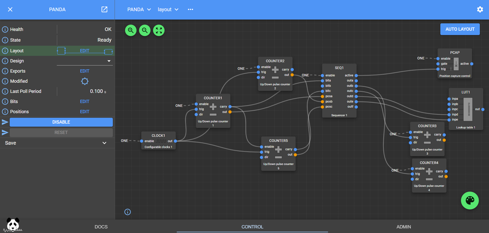

Data Collection and Analysis
============================
.. contents:: Table of Contents
   :depth: 2
Data Collection at SESAME
-------------------------

Data Collection and Analysis at SESAME is was activate begging of 2021 

There tasks 

- smooth and reliable data collection

- data analysis

- data storage

- provding essential pre and post processing tools

Experimental Data Management Policy of SESAME
---------------------------------------------

Policy Statement
................

The purpose of this Policy is to provide information and guidance to users conducting peer-reviewed and Director Discretionary time research on experimental data ownership, storage, access, and management. 

Coverage
.........

- This policy applies to raw data and metadata generated from peer-reviewed and Director Discretionary time research proposals and in-house experiments.
- It does not cover proprietary and industrial research conducted by Participatory Research Teams

General Principles
..................

- Acceptance of this Policy is a precondition for obtaining beam time for peer-reviewed and Director Discretionary time research proposals and in-house experiments.
- SESAME will strive to maximize long-term curation of data for a minimum of 5 years, with a target of 10 years.

Definitions
...........

- Experimental Data: Umbrella term for raw data and all associated metadata.
- Metadata: Information related to the experiment and experimental conditions.

Data Ownership and Access
..........................

- Raw data and associated metadata will become open access after a 3-year embargo period,
- Data and metadata will be curated in well-defined formats for long-term access.

Results
.......

- Ownership of results derived from data analysis will be determined by contractual obligations of individuals performing the analysis.
- SESAME will provide best effort curation of results and act as the long-term custodian.

Publication
...........

- Publications related to SESAME experiments must cite the persistent identifier of the experiment and data.
- References of related publications must be deposited in a publications database within 3 months of the publication date or during new beam time applications.

Compliance
...........
- Acceptance of the Experimental Data Management Policy is a precondition for obtaining beam time.
- Deliberate infringement may result in denial of data access and rejection of future beam time applications.

Tomoscan 
---------

it is a python based software for tomography data collection and analysis. 
which is used to collect data from SESAME tomography beamline.

Data Acquisition Testing Bench
------------------------------
The testing bench consists of five motors, from A to E, that can be controlled using EPICS. These motors are used to test various control programs that are to be used at SESAME beamlines.

Python-Based Client for Collection of Data from Testing Bench 
--------------------------------------------------------------
Rotational Motion Box
......................
A Python script was developed in order to home each of the motors in the testing bench. This is necessary in order to ensure the motors are calibrated correctly. 

The script works using a JSON file containing parameters for each motor in the testing bench. Specifically, these parameters are:

- ``pv_root``: The root of all of the PVs associated with the motor.
- ``lo_lim``: The soft-coded lower limit on the position of the motor.
- ``hi_lim``: The soft-coded higher limit on the position of the motor.
- ``center``: The "default" position of the motor, where it will be taken after the homing is complete (often takes on the value of 0).

Additionally, the JSON file contains general configuration parameters. For now, the only parameter is the tolerance, which is the difference between the hard limits and the soft limits on the motor positions.

This script is controlled via the terminal, and has five commands that can be executed:

- ``help``: Used to get usage information regarding a given command.
    - Usage: ``help command_name``
    - ``command_name``: The name of the command that the user would like help with.
- ``add``: Used to add a new motor to the JSON file.
    - Usage: ``add json_path motor_name pv_root lo_lim center hi_lim``
    - ``json_path``: The path to the JSON file containing the general and motor configurations.
    - ``motor_name``: The name of the motor to be added.
    - ``pv_root``: The PV root name used to access the motor.
    - ``lo_lim``: The soft-coded lower positional limit for the motor.
    - ``center``: The center position for the motor where it will be directed after homing.
    - ``hi_lim``: The soft-coded higher positional limit for the motor.
- ``change``: Used to change a preexisting motor in the JSON file.
    - Usage: ``change json_path motor_name pv_root lo_lim center hi_lim``
    - ``json_path``: The path to the JSON file containing the general and motor configurations.
    - ``motor_name``: The name of the motor to be changed.
    - ``pv_root``: The PV root name used to access the motor.
    - ``lo_lim``: The soft-coded lower positional limit for the motor.
    - ``center``: The center position for the motor where it will be directed after homing.
    - ``hi_lim``: The soft-coded higher positional limit for the motor.
- ``remove``: Used to remove a preexisting motor from the JSON file.
    - Usage: ``remove json_path motor_name``
    - ``json_path``: The path to the JSON file containing the general and motor configurations.
    - ``motor_name``: The name of the motor to be removed, or ``all`` to remove all available motors.
- ``home``: Used to begin homing for one or all of the motors.
    - Usage: ``home json_path motor_name homing_mode``
    - ``json_path``: The path to the JSON file containing the general and motor configurations.
    - ``motor_name``: The name of the motor to be homed, or ``all`` to home all available motors.
    - ``homing_mode``: The method to be used in homing, either ``hi`` to use the higher limit or ``lo`` to use the lower limit.

For example, in order to home all of the motors using the higher limit, navigate to the directory containing the Python script in the terminal and run:

.. code-block:: bash
    python3.9 test.py home test.json all hi
Where ``test.py`` is the Python script file name and ``test.json`` is the JSON file name.

Detector
........

Detector Step-Scan Data Acquistion and Analysis BEATS Beamline
---------------------------------------------------------------

The BEAmline for Tomography at SESAME (BEATS) works by propagating a hard X-ray full field tomogoraphy beam through small sample structures. The diffracted X-rays are measured by the detector and acquired as single 2D frames of the sample. Therefore, there would be a need to rotate the sample in order to get a full digital 3D reconstruction of the sample.

**Main Task:**

We must write a program that acquires frames of the cross-section of the sample and store them appropriately in a *HDF5 file* in *dX style.*

These are the main parameters to start implementing the step scan technique (to simulate more or less BEATS DAQ step scan):

- For the detector: (FLIR camera)

  1. Exposure time: FLIR5:cam5:AcquireTime                       (R/W)
     
  2. Num of images: FLIR5:cam5:NumImages                       (R/W)
     
  3. Acquiring mode: FLIR5:cam5:ImageMode (0:Single, 1:Multiple, 2:Continuous) (R/W)
     
  4. Start Acquiring: FLIR5:cam5:Acquire (0:Done, 1:Acquire)                                          (R/W)
     
  5. Acquiring status: FLIR5:cam5:AcquireBusy (0:Done, 1:Acquire)                               (Read only)
     
  6. Image counter: FLIR5:cam5:ArrayCounter_RBV          (Read only)
     
  7. Image sizeX: FLIR5:cam5:ArraySizeX_RBV                      (Read only)
     
  8. Image sizeY: FLIR5:cam5:ArraySizeY_RBV                      (Read only)
     
  9.  Total image size: FLIR5:cam5:ArraySize_RBV                (Read only)
      
  10. Trigger Mode: FLIR5:cam5:TriggerMode (0:off, 1:on)                                                (R/W)
      
  11. Trigger Source: FLIR5:cam5:TriggerSource (0:software)                                           (R/W)
      
  12. Trigger Software: FLIR5:cam5:TriggerSoftware (0: Done, 1:Trigger)                     (R/W)    // this pv mainly used for software triggering
      
  13. Enable NdArray: FLIR5:image1:EnableCallbacks (0:Disable, 1:Enable)                 (R/W)
      
  14. Image Array Data: Flir5:image1:ArrayData                                                                     (Read only)
 
- For motion stage (MICOS stage):
  
  1. Current position feedback: micos:m1.RBV    (Read only)
   
  2. Move motor: micos:m1.VAL                                (R/W)                    // used for moving the motor (absolute value)

**Objectives of the Program**

1. Implementing the step scan by taking the args from the user (exposure time, overall distance, step size)
   
2. Go to the home position (Position 0 abs. value)
   
3. For Each step you have to move the motor to the target position, you have to use the Motor record class to move and check if the motor movement is done, more info is found on these links: (https://epics.anl.gov/docs/APS2014/07-CA-Python.pdf , https://github.com/pyepics/pyepics/blob/master/epics/motor.py ).
   
4. Reshape the images according to the predefined size, and save it in a H5 file format in dxFile layout. 
   
5. Store the data (current position vs. timestamp in a .xdi file (file is available and attached as a part of the experimental data files for XAFS Beamline)

.. code-block:: python

    import h5py
    import numpy as np
    import time
    import argparse
    import epics
    import json
    import os
    from PIL import Image
    import threading

    class StepScan:
        def __init__(self, exposure_time, overall_distance, step_size, detector_pv, motion_stage_pv, camera_acq_pv,
                    image_size_x, image_size_y, image_counter, num_images, acq_mode, start_acq, acq_status,
                    trigger_mode, trigger_source, trigger_software, image_data ,exposure_time_pv):
            self.exposure_time = exposure_time
            self.overall_distance = overall_distance
            self.step_size = step_size
            self.detector = epics.PV(detector_pv)
            self.motion_stage = epics.Motor(motion_stage_pv)
            self.camera_acq_pv = camera_acq_pv
            self.image_size_x = int(epics.caget(image_size_x))
            self.image_size_y = int(epics.caget(image_size_y))
            self.image_counter = image_counter
            self.num_images = num_images
            self.acq_mode = acq_mode
            self.start_acq = start_acq
            self.acq_status = acq_status
            self.trigger_mode = trigger_mode
            self.trigger_source = trigger_source
            self.trigger_software = trigger_software
            self.image_data = image_data
            self.exposure_time_pv = exposure_time_pv

            # Set the exposure time
            epics.caput(self.exposure_time_pv, self.exposure_time)
            # Set the acquisition mode to multiple
            epics.caput(self.acq_mode, 1)

            # Enable the trigger mode to start the acquisition
            epics.caput(self.trigger_mode, 1)
            epics.caput(self.camera_acq_pv, 1)

            # Set the trigger source to 0 (software triggering)
            epics.caput(self.trigger_source, 0)

            steps_array = np.arange(0, overall_distance + step_size, step_size)
            print(f"{overall_distance} {step_size} type of overall distance: {type(overall_distance)} type of step size: {type(step_size)}")
            print(f"steps array: {steps_array}")
            num_step= len(steps_array) - 1
            print(f"num steps: {num_step}")
            epics.caput(self.num_images, num_step)
            print(f"num images: {epics.caget(self.num_images)}")

        def move_motor_to_position(self, position):
            self.motion_stage.move(position)
            while not self.motion_stage.done_moving:
                time.sleep(0.1)

        def save_image(self, image_data, file_name, image_size_x, image_size_y):
            if not os.path.exists("images"):
                os.makedirs("images")
            image_reshaped = np.reshape(image_data, (image_size_y, image_size_x))
            file_path = os.path.join("images", file_name.replace("npy", "png"))
            image_pil = Image.fromarray(image_reshaped)
            image_pil.save(file_path)
            print(f"Saved image to {file_path}")

        def acquire_image(self, trigger_software, image_counter, image_data, image_size_x, image_size_, num_steps):
            # Wait for the image counter to change, indicating a new image has been acquired
            initial_counter = epics.caget(image_counter)
            
            # Trigger the software trigger to initiate image acquisition
            epics.caput(trigger_software, 1)

            while True:
                time.sleep(0.1)
                current_counter = epics.caget(image_counter)
                if current_counter != initial_counter:
                    print(f"Image acquired with counter {current_counter}")
                    break

            # Retrieve the image data
            image_data = epics.caget(image_data)
            image_data = np.reshape(image_data, (self.image_size_y, self.image_size_x))
            return image_data
        def start_step_scan(self):

            f = h5py.File('step_scan.hdf5', 'w')
            
            num_steps = int(self.overall_distance / self.step_size)
            # Create detector and data groups
            detector_group = f.create_group('exchange/detector')
            data_group = f.create_group('exchange/data')

            # Add detector metadata
            detector_group.attrs['exposure_time'] = self.exposure_time  
            detector_group.attrs['image_size_x'] = self.image_size_x
            detector_group.attrs['image_size_y'] = self.image_size_y
            detector_group.attrs['Num_of_image'] = num_steps
            detector_group.attrs['local_name'] = "SESAME Detector"
            detector_group.attrs['pixel_size'] = 20E-6 # example
            

            for step in range(num_steps):

                # Move stage and acquire image
                target_position = step * self.step_size
                self.move_motor_to_position(target_position)
                image_data = self.acquire_image(self.trigger_software, self.image_counter, self.image_data ,self.image_size_x, self.image_size_y,num_steps)
                
                # Create dataset
                img_dataset = data_group.create_dataset(f'image_{step}', data=image_data)
                
                # Add metadata 
                img_dataset.attrs['distance'] = target_position
                img_dataset.attrs['timestamp'] = time.strftime("%Y-%m-%d %H:%M:%S")
            
            # Add scan metadata
            data_group.attrs['num_images'] = num_steps
            data_group.attrs['step_size'] = self.step_size

            f.close()

    def main(args):
        with open(args.config_file) as json_file:
            config = json.load(json_file)
            detector_pv = config.get("detector_pv")
            motion_stage_pv = config.get("motion_stage_pv")
            camera_acq_pv = config.get("camera_acq_pv")
            image_size_x = config.get("image_size_x")
            image_size_y = config.get("image_size_y")
            image_counter = config.get("image_counter")
            num_images = config.get("num_images")
            acq_mode = config.get("acq_mode")
            start_acq = config.get("start_acq")
            acq_status = config.get("acq_status")
            trigger_mode = config.get("trigger_mode")
            trigger_source = config.get("trigger_source")
            trigger_software = config.get("trigger_software")
            image_data = config.get("image_data")
            exposure_time_pv = config.get("exposure_time_pv")

        step_scan = StepScan(
            args.exposure_time,
            args.overall_distance,
            args.step_size,
            detector_pv,
            motion_stage_pv,
            camera_acq_pv,
            image_size_x,
            image_size_y,
            image_counter,
            num_images,
            acq_mode,
            start_acq,
            acq_status,
            trigger_mode,
            trigger_source,
            trigger_software,
            image_data,
            exposure_time_pv

        )
        step_scan.move_motor_to_position(0)  # Move to the home position (position 0)
        step_scan.start_step_scan()

    if __name__ == "__main__":
        parser = argparse.ArgumentParser(description="Step Scan using FLIR camera and MICOS stage.")
        parser.add_argument("exposure_time", type=float, help="Exposure time for the FLIR camera.")
        parser.add_argument("overall_distance", type=float, help="Overall distance to scan with the MICOS stage.")
        parser.add_argument("step_size", type=float, help="Step size for each scan step.")
        parser.add_argument("--config_file", default="config.json", help="JSON file containing PV names. (Default: config.json)")
        args = parser.parse_args()
        main(args)

EPICS-Qt-Based Client for Collection of Data from Testing Bench 
----------------------------------------------------------------

Motion Box
...........
A GUI was developed using Qt in order to more easily home the motors, as in Python-Based Client for Collection of Data from Testing Bench. This GUI consists of:
- A QComboBox (like a dropdown menu) for selecting one or all of the motors.
- Four QLineEdits (like textboxes) for viewing and modifying the ``pv_root``, ``lo_lim``, ``center``, and ``hi_lim`` for the selected motor in the JSON file (is blank when all motors are selected).
- A QPushButton for adding a new motor to the JSON file.
- A QPushButton for removing the selected motor(s).
- Two QPushButtons for homing the selected motor(s) using either the higher limit or the lower limit.
v
This GUI operates by sending commands to the Python script described in Python-Based Client for Collection of Data from Testing Bench via the terminal. It is therefore fairly finicky, as there isn't much feedback displayed in the GUI, and the directories for the Python script and the JSON file are hardcoded into the GUI.

Synchronization between BEATS Beameline Detector and Rotational Motor
----------------------------------------------------------------------

**Software and Hardware Synchronization**
..........................................

The goal of the software-based synchronization task was to emulate the BEATS Beamline detector's process of continuously capturing frames from the samples. In essence, this entails repeating the acquisition process throughout the full rotation of the sample.

This particular synchronization method's implementation is grounded in a kinematic and physical framework, where both components are linked by a common time-scale. We can extract the time variable from the angular velocity of the rotary motor and determine the number of frames per second captured by the detector.

Including the PV's in the previous exercise, the following are the extra PV's that should be taken into consideration in relation to the continuous scan method.

•	*For the detector: (FLIR camera)*

1.	Frame rate: FLIR5:cam5:GC_AcqResFrameRate_RBV                (Read only)

2.	Enable NdArray Array:            FLIR5:image1:ArrayCallbacks (0:Disable, 1:Enable)                 (R/W)    

3.	Enable NdArray Callbaks:      FLIR5:image1:EnableCallbacks (0:Disable, 1:Enable)                 (R/W)

4.	Enable ZMQ Array:                 FLIR5:ZMQ1:ArrayCallbacks (0:Disable, 1:Enable)                 (R/W)   

5.	Enable ZMQ Callbaks:             FLIR5:ZMQ1:EnableCallbacks (0:Disable, 1:Enable)                 (R/W)     

*: you should enable them before start acquiring

•	*For motion stage (MICOS stage):*

1.	Velocity: micos:m1.VELO           (R/W)

2.	Max. velocity: micos:m1.VMAX          (R/W)

3.	Acceleration time: micos:m1.ACCL    (Read only)

**Objectives of the Program:**

1.	Implementing the continuous scan by taking the args from the user (exposure time, overall distance, step size, #of projections).

2.	Synchronization: calculating the motor speed based on FPS (as I explained it to you).

3.	Implementing any other kinematics equations related to the motion.

4.	Receiving the frames using ZMQ socket. 

-   ZMQ reference: https://zeromq.org/languages/python/ 
-   Connection parameters to ZMQ socket: IP: 127.0.0.1, Port: 1234

5.	Implement parallel processing technique to handle the process (here you will deal with low FPS). https://docs.python.org/3/library/multiprocessing.html

6.	Store the data in HDF5 file.

.. code-block:: python
    
    import numpy as np
    import h5py
    import argparse
    import time
    import epics
    import zmq
    import multiprocessing
    from stepscan import StepScan
    from config import *

    class ContinuousScan:
        def __init__(self, exposure_time, total_distance, step_size, detector_pv, motion_stage_pv, camera_acq_pv, image_size_x, image_size_y, image_counter,  acq_mode, start_acq, acq_status, trigger_mode, trigger_source, trigger_software, image_data, exposure_time_pv, frame_rate_pv, accelaration_time_pv, enable_ndarray, enable_ndarray_callbacks, enable_ZMQ_Array, enable_ZMQ_callbacks, zmq_port, zmq_host, num_images):
            self.exposure_time = exposure_time
            self.total_distance = total_distance
            self.step_size = step_size
            self.num_steps = int(np.ceil(self.total_distance / self.step_size))
            self.hdf_file = "scan_data.hdf5"
            self.exposure_time_pv = exposure_time_pv
            self.motion_stage_pv = motion_stage_pv
            self.fps_pv = frame_rate_pv
            self.camera_acq_pv = camera_acq_pv
            self.image_size_x = int(epics.caget(image_size_x))
            self.image_size_y = int(epics.caget(image_size_y))
            self.image_counter = image_counter
            self.num_images = num_images
            self.image_data = image_data
            self.acq_mode = acq_mode
            self.start_acq = start_acq
            self.acq_status = acq_status
            self.trigger_mode = trigger_mode
            self.trigger_source = trigger_source
            self.trigger_software = trigger_software
            self.acceleration_time = float(epics.caget(accelaration_time_pv))
            self.motion_stage = None
            self.velocity = None
            self.accel_distance = None
            self.deccel_distance = None
            self.constant_distance = None
            self.acceleration_time_pv = accelaration_time_pv
            self.fps = epics.caget(self.fps_pv)
            self.enable_ndarray = epics.caput(enable_ndarray, 1)
            self.enable_ndarray_callbacks = epics.caput(
                enable_ndarray_callbacks, 1)
            self.enable_ZMQ_Array = epics.caput(enable_ZMQ_Array, 1)
            self.enable_ZMQ_callbacks = epics.caput(enable_ZMQ_callbacks, 1)
            self.num_images = int(np.ceil(self.total_distance / self.step_size))
            self.context = zmq.Context()
            self.socket = self.context.socket(zmq.PULL)
            self.socket.bind(f"tcp://127.0.0.1:1234")
            self.queue = multiprocessing.Queue()

        def receive_data_via_zmq(self):
            while True:
                data = self.socket.recv_pyobj()
                if data is None:
                    break
                self.queue.put(data)

        def calculate_total_time(self, fps):
            time_per_frame = 1/fps
            self.total_time = time_per_frame * self.total_distance
            return self.total_time

        def calculate_velocity(self, fps):
            self.calculate_total_time(fps)
            print(f"FPS: {fps}")
            self.velocity = self.total_distance / self.total_time
            return float(self.velocity)

        def calculate_accel_distance(self):
            self.calculate_total_time(self.fps)
            self.accel_distance = (self.total_distance *
                                self.acceleration_time) / self.total_time
            self.deccel_distance = self.accel_distance
            return float(self.accel_distance)

        def calculate_constant_distance(self):
            self.calculate_accel_distance()
            self.constant_distance = self.total_distance - \
                (self.accel_distance + self.deccel_distance)
            return float(self.constant_distance)

        def move_epics_motor(self, position):
            self.motion_stage.move(position)
            while not self.motion_stage.done_moving:
                time.sleep(0.1)

        def setup_camera(self):
            epics.caput(self.acq_mode, 1)
            epics.caput(self.trigger_mode, 0)
            epics.caput(self.trigger_source, 0)
            epics.caput(self.camera_acq_pv, 0)

        def save_to_hdf5(self, data):
            with h5py.File(self.hdf_file, 'a') as hdf:
                group_name = f'image_{self.image_counter}'
                hdf.create_group(group_name)
                hdf[group_name]['image_data'] = data

        def process_image_data(self):
            while True:
                if self.queue.empty():
                    time.sleep(0.1)
                    continue
                data = self.queue.get()
                # Save the acquired image data to HDF5
                self.save_to_hdf5(data)

        def perform_continuous_scan(self):
            # Connect to the motion stage and get the fps value and setup the camera
            self.setup_camera()
            self.motion_stage = epics.Motor(self.motion_stage_pv)
            fps = epics.caget(self.fps_pv)
            self.calculate_velocity(fps)
            accel_d = self.calculate_accel_distance()
            print(f"accel_d: {accel_d}, type: {type(accel_d)}")
            self.move_epics_motor(0 - float(accel_d))
            print(f"Accelerating to steady speed...")

            zmq_process = multiprocessing.Process(target=self.receive_data_via_zmq)
            zmq_process.start()

            processing_process = multiprocessing.Process(
                target=self.process_image_data)
            processing_process.start()
            for _ in range(self.num_images):
                epics.caput(self.start_acq, 1)  # Trigger image acquisition
                time.sleep(self.exposure_time)  # Wait for exposure to complete
                # Capture and process the acquired image data
                image_data = self.image_data  # Replace with actual image data retrieval
                self.queue.put(image_data)

            # Stop the ZMQ and processing processes
            zmq_process.terminate()
            processing_process.terminate()

            self.move_epics_motor(self.total_distance + float(accel_d))

    def main(args):
        Config(args.config_file)
        continuous_scan = ContinuousScan(
            args.exposure_time,
            args.overall_distance,
            args.step_size,
            detector_pv,
            motion_stage_pv,
            camera_acq_pv,
            image_size_x,
            image_size_y,
            image_counter,
            num_images,
            acq_mode,
            start_acq,
            acq_status,
            trigger_mode,
            trigger_source,
            trigger_software,
            image_data,
            exposure_time_pv,
            frame_rate_pv,
            accelaration_time_pv,
            enable_ndarray,
            enable_ndarray_callbacks,
            enable_ZMQ_Array,
            enable_ZMQ_Callbacks,
            zmq_port,
            zmq_host)

        continuous_scan.setup_camera()

        continuous_scan.perform_continuous_scan(1234, "localhost")

    if __name__ == "__main__":
        parser = argparse.ArgumentParser(
            description="Step Scan using FLIR camera and MICOS stage.")
        parser.add_argument("exposure_time", type=float,
                            help="Exposure time for the FLIR camera.")
        parser.add_argument("overall_distance", type=float,
                            help="Overall distance to scan with the MICOS stage.")
        parser.add_argument("step_size", type=float,
                            help="Step size for each scan step.")
        parser.add_argument("--config_file", default="config.json",
                            help="JSON file containing PV names. (Default: config.json)")
        args = parser.parse_args()
        main(args)

PandABlocks: Hardware Synchronization Mechanisms and Resource Offerings
.............................................................................

PandABlocks, an integrated position, acquisition, and control system, emerges as a groundbreaking solution tailored to fulfill the demands of contemporary experiments. Capable of processing absolute encoder inputs, PandABlocks effortlessly orchestrates the synchronized calculation, control, and recording of multiple hardware component positions. Born out of a collaborative effort between SOLEIL and DIAMOND, PandABlocks redefines position and acquisition processing platforms, ushering in a new era of scientific exploration. Its foundation rests on the powerful Zynq 7030 architecture, known for its versatility and reliability, while accommodating a range of encoder standards. This state-of-the-art platform is armed with synchronous triggering, data capture, and data manipulation capabilities, making it an indispensable asset for cutting-edge experiments.

**A Collaborative project:**

The culmination of synergistic efforts between SOLEIL and DIAMOND, PandABlocks epitomizes the fusion of innovation and expertise. Built upon the foundation of Diamond's 'Zebra' and SOLEIL's 'SPEITBOX,' PandABlocks inherits and enhances the strengths of its predecessors. Notably, the platform leverages absolute encoder protocols, enabling precise and accurate positional information. Furthermore, PandABlocks ensures seamless data transfer at higher bandwidths, thus eliminating data bottlenecks that could hinder experimental progress. One of its defining features is the augmentation of FPGA resources, endowing the system with unprecedented computational power, setting the stage for tackling the complex challenges of future experiments.

**Sans-IO Library:**

The decision to create a Sans-IO library for PandABlocks stems from the imperative of reusability and adaptability. By encapsulating the protocol in a distinct class separate from I/O operations, PandABlocks aligns with a variety of concurrency frameworks, facilitating integration into diverse operational environments. This design philosophy finds practical manifestation in the creation of both a BlockingClient and an AsyncioClient, two distinct implementations that draw upon the shared protocol encapsulation, aptly named a Connection. This approach ensures that the protocol remains agnostic to the underlying I/O mechanics, providing the freedom to seamlessly transition between different concurrency models without compromising performance or functionality.

**Optimizing Data Transfer:**

A paramount consideration in the PandABlocks ecosystem is the optimization of HDF file writing speed. Numerous factors influence the rate at which data can be efficiently written, ranging from trigger frequency to CPU load on the PandA. The library's robust architecture addresses these factors comprehensively, providing strategies to maximize data throughput and ensure smooth operation. By averaging data, scaling it on the client side, and adopting a judicious flush rate, PandABlocks strikes a harmonious balance between real-time data capture and efficient utilization of resources. Additionally, the removal of the panda-webcontrol package contributes to streamlined performance, enhancing the overall efficiency of the system.

In conclusion, PandABlocks stands as a pinnacle of innovation, seamlessly merging advanced synchronization mechanisms with a rich array of resources. Its collaborative origins, rooted in the collaboration between SOLEIL and DIAMOND, underscore its commitment to excellence. By embodying principles of flexibility and adaptability through the Sans-IO library, PandABlocks empowers users to harness its capabilities within diverse operational contexts. Through strategic optimization strategies, PandABlocks champions efficient data transfer and processing, ensuring that the platform remains at the forefront of experimental endeavors, poised to shape the future of scientific exploration.
